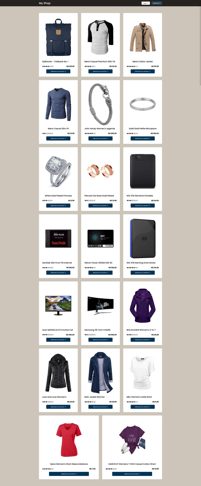
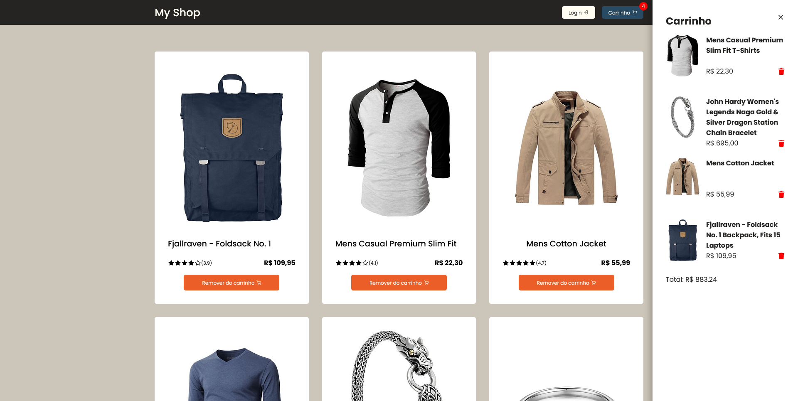

<h1 align="center">MyShop - Ecommerce</h1>

<p align="center">
 <a href="#-sobre-o-projeto">Sobre</a> •
 <a href="#-layout">Layout</a> • 
 <a href="#-como-executar">Como executar</a> • 
 <a href="#-stack-utilizada">Stack utilizadas</a> • 
 <a href="#-autor">Autor</a> • 
 <a href="#user-content--licença">Licença</a>
</p>

## 💻 Sobre o projeto

MyShop é um projeto de ecommerce desenvolvido junto ao curso de ReactJS da ADA, oferecida pelo **Santander Open Academy** no projeto **Santander Coders**. A ideia do projeto é criar o layout de um ecommerce juntando todos os conhecimentos em ReactJS aprendido durante o curso.

## 🎨 Layout




## Como executar o projeto

Este projeto é feito todo em React, e não temos nenhum back-end envolvido, desta forma a instalação é bem fácil, caso queira rodar em sua maquina.

```bash
# Clone este repositório
$ git clone git@github.com:devjuanvinicius/myshop.git

# Acesse a pasta do projeto no terminal/cmd
$ cd myshop

# Instale as dependências
$ npm install

# Execute a aplicação
$ npm run dev

# O servidor inciará na porta:3333 - acesse http://localhost:3333
```

## 🛠️ Stack utilizada

**Front-end ([React](https://react.dev/) + [TypeScript](https://www.typescriptlang.org/))**

- [Styled Components](https://styled-components.com/)
- [React Icons](https://react-icons.github.io/react-icons/)
- [Redux](https://redux.js.org/)
- [Axios](https://github.com/axios/axios)

## Autor

[](https://www.linkedin.com/in/juan-vinicius-dev/)
[](mailto:dev.juanvinicius@gmail.com)

## Licença

[MIT](https://choosealicense.com/licenses/mit/)
